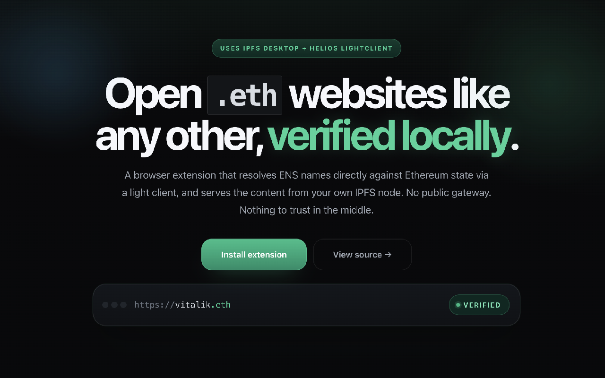
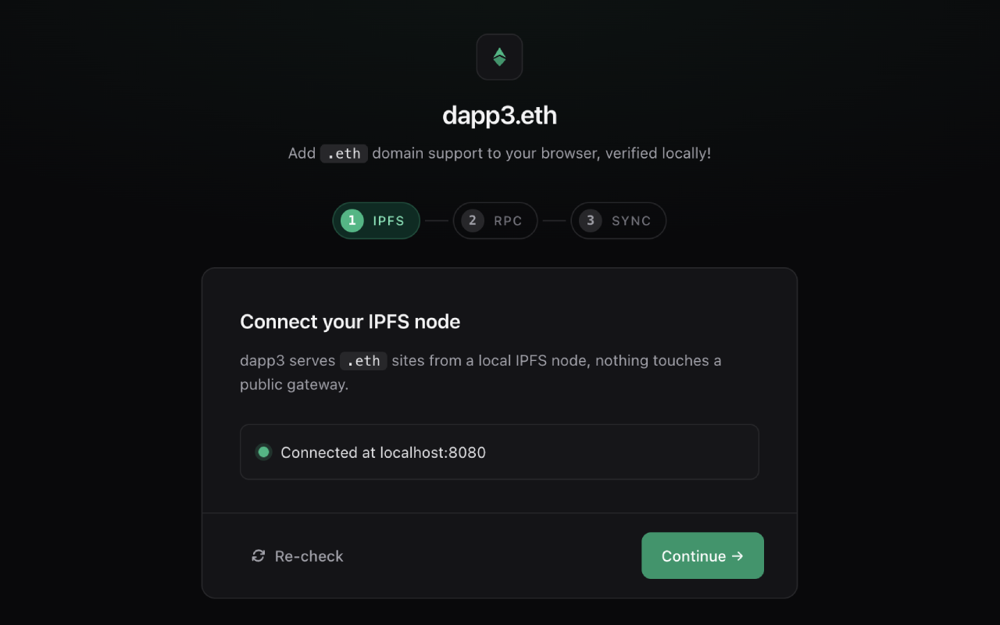
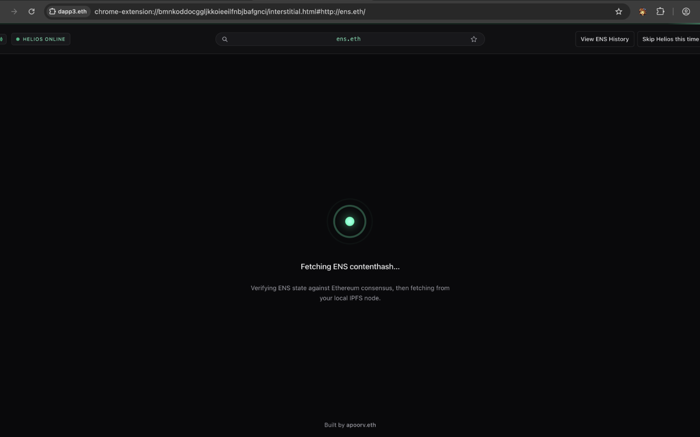
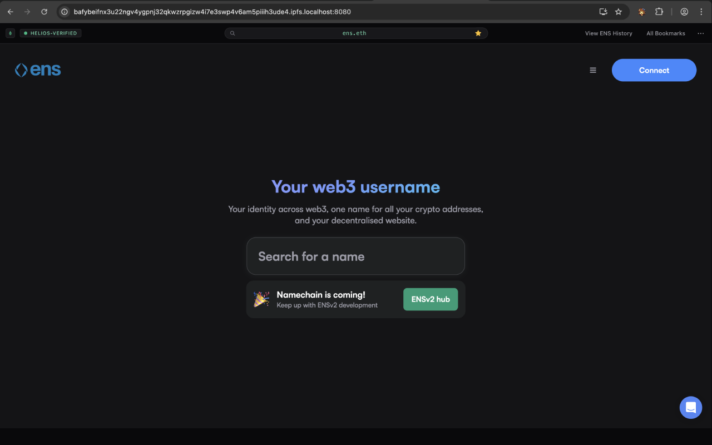
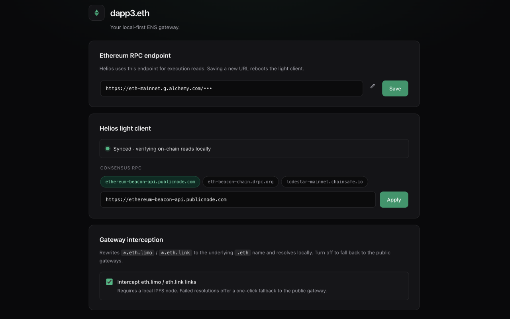
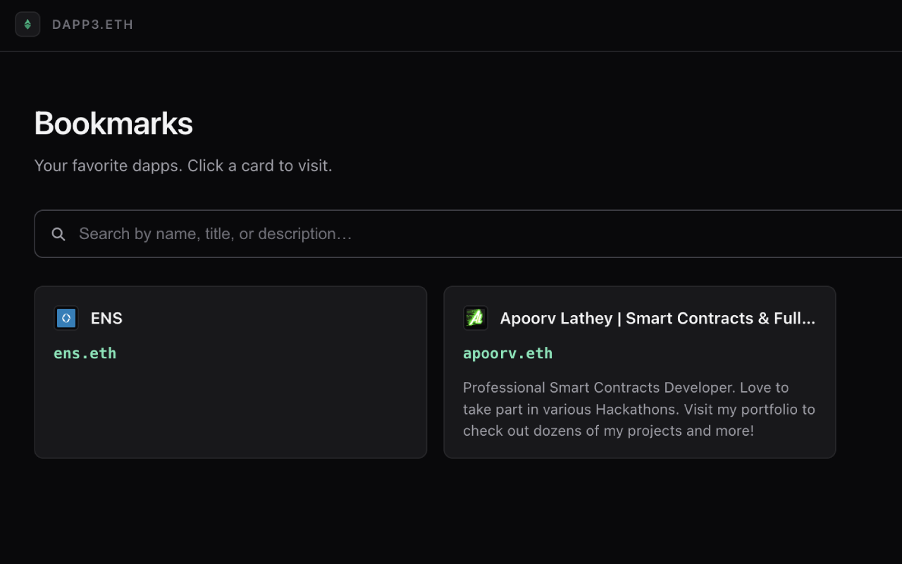

# dapp3.eth



<p align="center">
  <a href="https://dapp3.eth.link"><strong>dapp3.eth.link →</strong></a>
</p>

**Open `.eth` websites like any other, verified locally.**

A Chromium extension that resolves ENS names directly against Ethereum state via a [Helios](https://github.com/a16z/helios) light client, and serves the content from your own local [Kubo](https://github.com/ipfs/kubo) IPFS node. No public gateway, no hijackable DNS, no TLS middleman. Nothing to trust in the middle.

> Built as a trust-minimized replacement for `eth.limo`.

---

## How it works

1. You type `vitalik.eth` in the address bar.
2. The extension intercepts the navigation before the browser does DNS.
3. Helios (running in an offscreen document) verifies an `eth_call` against the ENS resolver, reads the `contenthash`, and decodes it to a CIDv1 or IPNS key.
4. The tab redirects to `http://<cid>.ipfs.localhost:8080/`, and your own Kubo node serves the content. Each site gets its own browser origin (cookies, storage, service-worker scope).
5. A content-script banner keeps the original ENS name visible and shows the live Helios verification status.

```
 address bar           service worker            offscreen doc          local Kubo
┌──────────┐          ┌────────────────┐        ┌──────────────┐      ┌────────────┐
│vitalik.eth│─intercept→│ resolve ENS  │──RPC──→│   Helios     │      │            │
└──────────┘          │ via viem     │        │ light client │      │            │
                      │              │←─proof─│ (verifies)   │      │            │
                      │ redirect tab │────────┴──────────────┘──────→│ <cid>.ipfs │
                      └──────────────┘                                │ .localhost │
                                                                      └────────────┘
```

For the deep end (why `modulePreload: false` is load-bearing, why the resolver runs in the SW but Helios doesn't, and every landmine we've hit), see [`IMPLEMENTATION.md`](./IMPLEMENTATION.md). For scope, non-goals, and milestones, see [`PRD.md`](./PRD.md).

---

## Screens

| Onboarding | Interstitial while Helios syncs |
|---|---|
|  |  |

| Resolved ENS page with Helios-verified banner | Options: RPC, Helios, and gateway interception |
|---|---|
|  |  |

Bookmarks view (`dapp3.eth` internal page):



---

## Prerequisites

- **Chromium 116+** (Chrome, Brave, Arc, Edge).
- **[IPFS Desktop](https://docs.ipfs.tech/install/ipfs-desktop/)** (or any Kubo node) running locally, with the subdomain gateway at `http://localhost:8080` and the RPC at `http://127.0.0.1:5001`.
- **Node 20+** and **pnpm** (only if you're building from source).

## Install

Grab the packaged build from the [Chrome Web Store](https://chromewebstore.google.com/) *(listing pending)*, or load an unpacked build yourself (see below).

## Build from source

Extension code lives under `extension/`. All `pnpm` commands run from there.

```sh
cd extension
pnpm install
pnpm build          # tsc --noEmit + vite build → extension/dist/
```

Then in `chrome://extensions`:
1. Enable **Developer mode**.
2. **Load unpacked** → select `extension/dist/`.

For iterative development:

```sh
pnpm dev            # HMR for options / popup / content pages
pnpm typecheck      # tsc --noEmit only
```

> Service-worker changes don't hot-reload. Reload the extension from `chrome://extensions` after editing anything under `src/background/`.

## Scope

- Chromium MV3 only.
- Ethereum mainnet only.
- `.eth` names only (no CCIP-read in v1).
- No public IPFS fallback by default: the whole point is local-first.

See [`PRD.md § Non-Goals`](./PRD.md#3-non-goals-v1) for the full list.

## Repo layout

```
extension/        Chrome MV3 extension (the actual product)
website/          Landing page (dapp3.eth)
PRD.md            Scope, architecture, progress log
IMPLEMENTATION.md Runtime model, Helios gotchas, landmines
PRIVACY_POLICY.md
PUBLISHING.md     Chrome Web Store release flow
```

